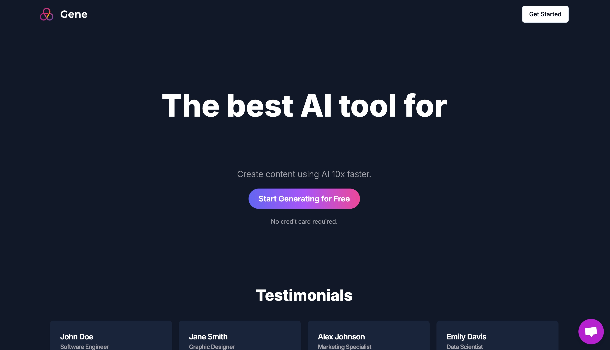

# 🧠 Gene

Welcome to **Gene** — a powerful, scalable AI SaaS platform designed for creativity and efficiency, it offers a seamless user experience for unique content generation built with **Next.js**, **TypeScript**, **Tailwind CSS**, **PostgreSQL**, **Prisma**, and **Stripe** for payments.

## 🔥 Preview

## 🚀 Tech Stack

- **Next.js** — For server-side rendering and routing.
- **TypeScript** — For type safety and better developer experience.
- **Tailwind CSS** — For fast, responsive styling.
- **PostgreSQL** — As the reliable database.
- **Prisma** — For an easy-to-use, type-safe ORM.
- **Stripe** — For handling subscriptions and payments.

## 🎯 Features

- **User authentication** (Sign up, login, logout).
- **Payment integration** with Stripe.
- **Subscription management** (monthly/annual plans).
- **Dashboard** with dynamic content.
- **SEO optimized** with Next.js.

## 📁 Project Setup

1. **Clone the repo:**

2. **Install dependencies:**

3. **Set up environment variables:**
   Create a `.env` file in the root directory and add the following:

4. **Run development server:**

   Open [http://localhost:3000](http://localhost:3000) to view the page.

## 🎨 Design Inspiration

Designed with a clean, minimalist UI — keeping user experience smooth and modern.

## 🔗 Links

- **Live Demo:** [https://ai-saas-pi-orp